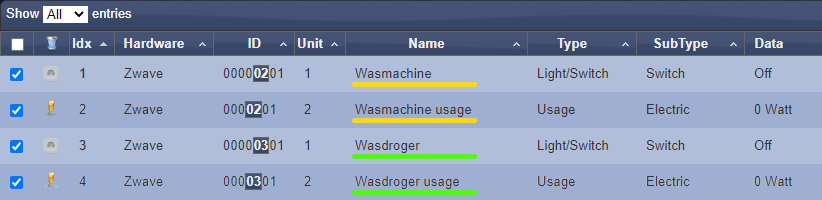
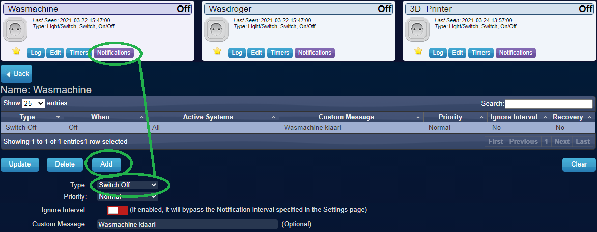

# Is the washing machine done?
This [Domoticz](https://www.domoticz.com/) DzVents script checks if a switch has been turned on, or the device is using more power than 'StandbyMaxWatt'.
'TimeOut' minutes after the switch (and the device) has been turned on, the code start to check if the machine is done.
If the switch is turned off, or the device uses 0Watt, or it uses less than 'StandbyMaxWatt' average over 'TimeOut' minutes, The Switch (and the device) is turned off.
This is useful so you can attach a notification when the switch turns off (and thus when the device is done), This is extremely useful for washing machines, dryers, and 3D printers for example.

# Setup
1. Buy a smart Switch to turn a device off/on, AND a smart kWh measuring device (Can be both at once like the [WR01ZE](https://nl.aliexpress.com/item/32825362894.html) plug (zwave stick required))
2. Add to Domoticz, and check both are working
3. Go to Setup/Devices in Domoticz
4. Rename the switch 'Type=Light/Switch, SubType=Switch' to the set 'SwitchName' (These are defined in the scipt [Vbscript.lua](Vbscript.lua) in the 'DEVICES' declaration) <ins>As the point of writing this, the SwitchName also need to be declaired in 'data' seperatly</ins>
5. Rename the meter with 'Type=Usage, SubType=Electric, Data=Electric in Watt' to the set 'MeterName' 
6. Redo the last 2 steps (with different names) for each device you wish to use
7. Add the code in Setup/More options/Events and then add(+) dzVents. just copy the text in [Vbscript.lua](Vbscript.lua) into the field
8. Optionally add a 'Switch off' notification, this can just be done in Domoticz on the given SwitchName

Example config:

Example notification config:

# Credits and links
Credits to the old Version 2.0 made by [@felix63](https://www.domoticz.com/forum/viewtopic.php?t=23798)

Altough I am unsure of this is the origen, I would like to mention [@nayrnet](https://github.com/nayrnet/domoticz-scripts)

And [here](https://www.domoticz.com/wiki/DzVents:_next_generation_Lua_scripting) is some more info about the DzVents language
